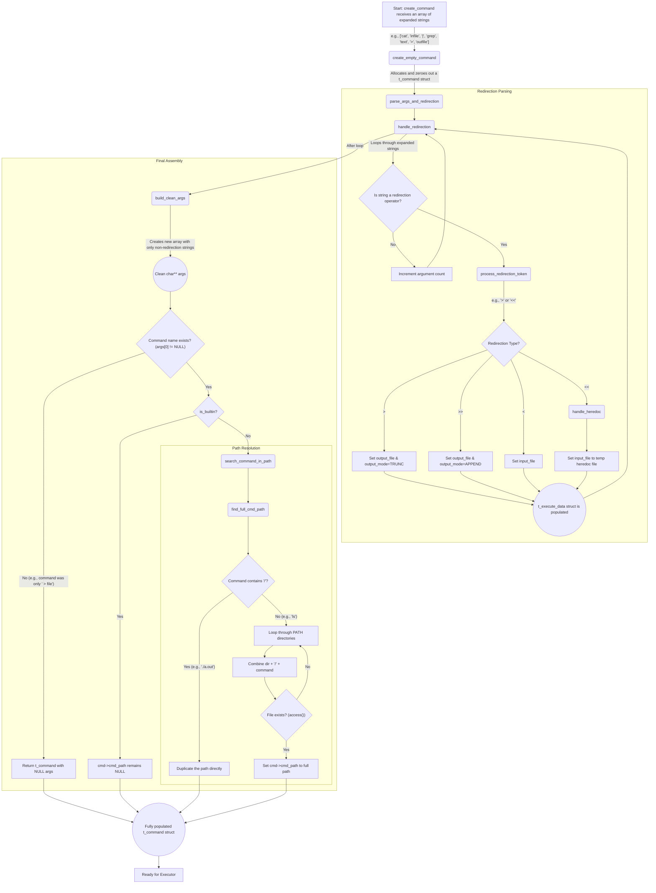

```mermaid
graph TD
    A[Start: create_command receives an array of expanded strings];
    A -- "e.g., ['cat', 'infile', '|', 'grep', 'text', '>', 'outfile']" --> B(create_empty_command);
    B -- "Allocates and zeroes out a t_command struct" --> C(parse_args_and_redirection);
    
    subgraph Redirection Parsing
        C --> D(handle_redirection);
        D -- "Loops through expanded strings" --> E{Is string a redirection operator?};
        E -- No --> F[Increment argument count];
        F --> D;
        E -- Yes --> G(process_redirection_token);
        G -- "e.g., '>' or '<<'" --> H{Redirection Type?};
        H -- ">" --> I[Set output_file & output_mode=TRUNC];
        H -- ">>" --> J[Set output_file & output_mode=APPEND];
        H -- "<" --> K[Set input_file];
        H -- "<<" --> L(handle_heredoc);
        L --> M[Set input_file to temp heredoc file];
        I --> N((t_execute_data struct is populated));
        J --> N;
        K --> N;
        M --> N;
        N --> D;
    end

    subgraph Final Assembly
        D -- After loop --> O(build_clean_args);
        O -- "Creates new array with only non-redirection strings" --> P((Clean char** args));
        P --> Q{"Command name exists? (args[0] != NULL)"};
        Q -- No (e.g., command was only ' > file') --> R[Return t_command with NULL args];
        
        Q -- Yes --> S{is_builtin?};
        S -- Yes --> T[cmd->cmd_path remains NULL];
        S -- No --> U(search_command_in_path);
        
        subgraph Path Resolution
            U --> V(find_full_cmd_path);
            V --> W{Command contains '/'?};
            W -- Yes (e.g., './a.out') --> X[Duplicate the path directly];
            W -- No (e.g., 'ls') --> Y["Loop through PATH directories"];
            Y --> Z["Combine dir + '/' + command"];
            Z --> AA{"File exists? (access())"};
            AA -- Yes --> BB[Set cmd->cmd_path to full path];
            AA -- No --> Y;
        end
    end
    
    R --> CC;
    T --> CC;
    X --> CC;
    BB --> CC((Fully populated t_command struct));
    CC --> DD[Ready for Executor];
```