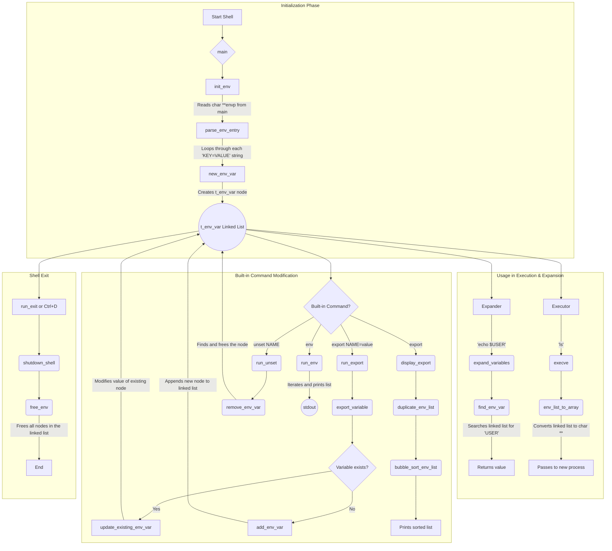

```mermaid
graph TD
    subgraph Initialization Phase
        A[Start Shell] --> B{main};
        B --> C[init_env];
        C -- "Reads char **envp from main" --> D[parse_env_entry];
        D -- "Loops through each 'KEY=VALUE' string" --> E[new_env_var];
        E -- "Creates t_env_var node" --> F((t_env_var Linked List));
    end

    subgraph Usage in Execution & Expansion
        F --> G[Expander];
        G -- "'echo $USER'" --> H(expand_variables);
        H --> I(find_env_var);
        I -- "Searches linked list for 'USER'" --> J[Returns value];

        F --> K[Executor];
        K -- "'ls'" --> L(execve);
        L --> M(env_list_to_array);
        M -- "Converts linked list to char **" --> N[Passes to new process];
    end

    subgraph Built-in Command Modification
        F --> O{Built-in Command?};
        O -- "export NAME=value" --> P(run_export);
        P --> Q(export_variable);
        Q --> R{Variable exists?};
        R -- Yes --> S[update_existing_env_var];
        S -- "Modifies value of existing node" --> F;
        R -- No --> T[add_env_var];
        T -- "Appends new node to linked list" --> F;

        O -- "export" --> P_display(display_export);
        P_display --> P_dup(duplicate_env_list);
        P_dup --> P_sort(bubble_sort_env_list);
        P_sort --> P_print[Prints sorted list];

        O -- "unset NAME" --> U(run_unset);
        U --> V(remove_env_var);
        V -- "Finds and frees the node" --> F;
        
        O -- "env" --> W(run_env);
        W -- "Iterates and prints list" --> X((stdout));
    end
    
    subgraph Shell Exit
        F --> Y[run_exit or Ctrl+D];
        Y --> Z(shutdown_shell);
        Z --> AA(free_env);
        AA -- "Frees all nodes in the linked list" --> BB[End];
    end
```