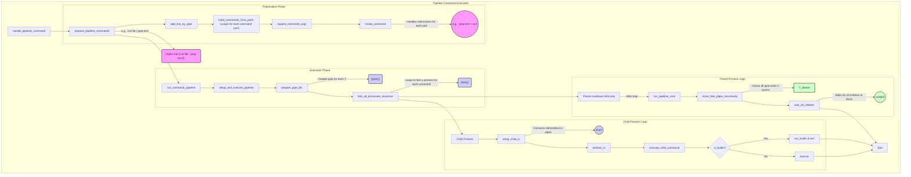

```mermaid
graph TD
    subgraph Pipeline Command Execution
        A[handle_pipeline_command] --> B[prepare_pipeline_commands];
        B -- "e.g., 'cat file | grep text'" --> B_details("(Splits into ['cat file', 'grep text'])");
        B --> C[run_command_pipeline];

        subgraph Preparation Phase
            B --> D[split_line_by_pipe];
            D --> E["build_commands_from_parts (Loops for each command part)"];
            E --> F[expand_command_args];
            F --> G[create_command];
            G -- "Handles redirections for each part" --> G_details((e.g., 'grep text > out'));
        end

        subgraph Execution Phase
            C --> H[setup_and_execute_pipeline];
            H --> I[prepare_pipe_fds];
            I -- "Creates pipe for each '|'" --> I_details("(pipe())");
            I --> J[fork_all_processes_recursive];
            J -- "Loops to fork a process for each command" --> J_details("(fork())");
        end

        subgraph Child Process Logic
            J --> K[Child Process];
            K --> L[setup_child_io];
            L -- "Connects stdin/stdout to pipes" --> L_details((dup2));
            L --> M[redirect_io];
            M --> N[execute_child_command];
            N --> O{is_builtin?};
            O -->|Yes| P[run_builtin & exit];
            O -->|No| Q[execve];
        end

        subgraph Parent Process Logic
            J --> R[Parent continues fork loop];
            R -- "After loop" --> S[run_pipeline_core];
            S --> T[close_free_pipes_recursively];
            T -- "Closes all pipe ends in parent" --> T_details;
            T --> U[wait_all_children];
            U -- "Waits for all children to finish" --> U_details((waitpid));
        end

        P --> V[End];
        Q --> V[End];
        U --> V;
    end
    
    style B_details fill:#f9f,stroke:#333,stroke-width:2px;
    style G_details fill:#f9f,stroke:#333,stroke-width:2px;
    style I_details fill:#ccf,stroke:#333,stroke-width:2px;
    style J_details fill:#ccf,stroke:#333,stroke-width:2px;
    style L_details fill:#ccf,stroke:#333,stroke-width:2px;
    style T_details fill:#cfc,stroke:#333,stroke-width:2px;
    style U_details fill:#cfc,stroke:#333,stroke-width:2px;
```