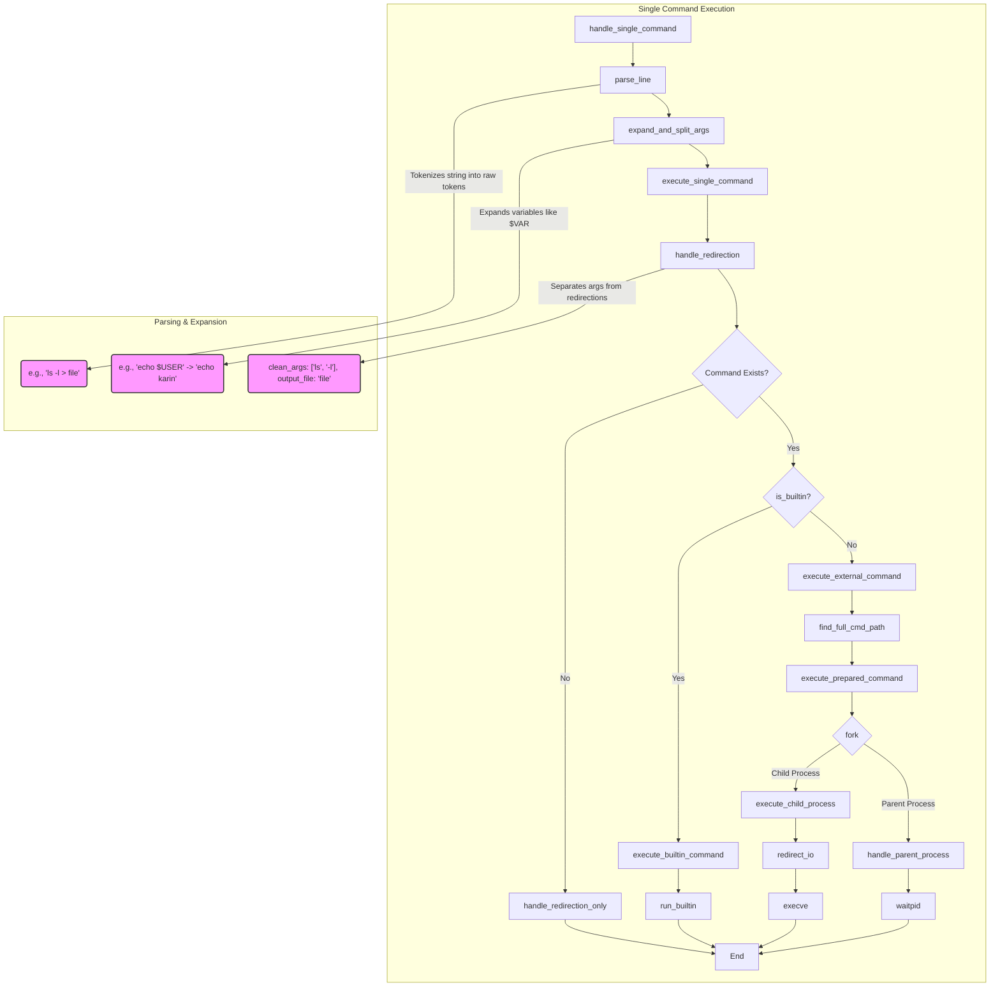

```mermaid
graph TD
    subgraph Single Command Execution
        A[handle_single_command] --> B[parse_line];
        B --> C[expand_and_split_args];
        C --> D[execute_single_command];
        D --> E[handle_redirection];
        E --> F{Command Exists?};

        F -->|Yes| G{is_builtin?};
        F -->|No| H[handle_redirection_only];

        G -->|Yes| I[execute_builtin_command];
        G -->|No| J[execute_external_command];

        I --> K[run_builtin];
        
        J --> L[find_full_cmd_path];
        L --> M[execute_prepared_command];
        M --> N{fork};

        N -->|Child Process| O[execute_child_process];
        N -->|Parent Process| P[handle_parent_process];
        
        O --> Q[redirect_io];
        Q --> R[execve];
        
        P --> S[waitpid];

        H --> T[End];
        K --> T;
        R --> T;
        S --> T;
    end

    subgraph Parsing & Expansion
        B -- "Tokenizes string into raw tokens" --> B_details(e.g., 'ls -l > file');
        C -- "Expands variables like $VAR" --> C_details(e.g., 'echo $USER' -> 'echo karin');
        E -- "Separates args from redirections" --> E_details("clean_args: ['ls', '-l'], output_file: 'file'");
    end

    style B_details fill:#f9f,stroke:#333,stroke-width:2px;
    style C_details fill:#f9f,stroke:#333,stroke-width:2px;
    style E_details fill:#f9f,stroke:#333,stroke-width:2px;
```