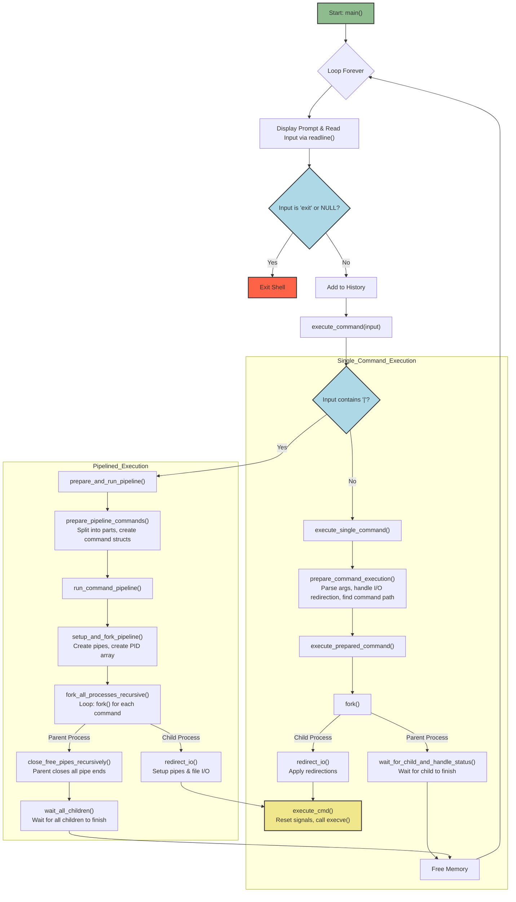

```mermaid
flowchart TD
    A["Start: main()"] --> B{Loop Forever}
    B --> C["Display Prompt & Read Input via readline()"]
    C --> D{"Input is 'exit' or NULL?"}
    D -- Yes --> E[Exit Shell]
    D -- No --> F[Add to History]
    F --> G["execute_command(input)"]
    G --> H{"Input contains '|'?"}

    subgraph Single_Command_Execution
        H -- No --> I["execute_single_command()"]
        I --> J["prepare_command_execution()<br>Parse args, handle I/O redirection, find command path"]
        J --> K["execute_prepared_command()"]
        K --> L["fork()"]
        L -- Child Process --> M["redirect_io()<br>Apply redirections"]
        M --> N["execute_cmd()<br>Reset signals, call execve()"]
        L -- Parent Process --> O["wait_for_child_and_handle_status()<br>Wait for child to finish"]
        O --> P[Free Memory]
    end

    subgraph Pipelined_Execution
        H -- Yes --> Q["prepare_and_run_pipeline()"]
        Q --> R["prepare_pipeline_commands()<br>Split into parts, create command structs"]
        R --> S["run_command_pipeline()"]
        S --> T["setup_and_fork_pipeline()<br>Create pipes, create PID array"]
        T --> U["fork_all_processes_recursive()<br>Loop: fork() for each command"]
        U -- Child Process --> V["redirect_io()<br>Setup pipes & file I/O"]
        V --> N
        U -- Parent Process --> W["close_free_pipes_recursively()<br>Parent closes all pipe ends"]
        W --> X["wait_all_children()<br>Wait for all children to finish"]
        X --> P
    end

    P --> B

    style A fill:#8fbc8f,stroke:#333,stroke-width:2px
    style E fill:#ff6347,stroke:#333,stroke-width:2px
    style H fill:#add8e6,stroke:#333,stroke-width:2px
    style D fill:#add8e6,stroke:#333,stroke-width:2px
    style N fill:#f0e68c,stroke:#333,stroke-width:2px
```