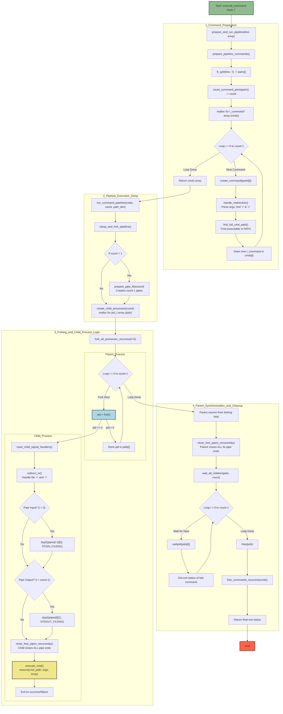

```mermaid
graph TD
    A["Start: execute_command finds '|'"] --> B["prepare_and_run_pipeline(line, envp)"];

    subgraph 1_Command_Preparation
        B --> C["prepare_pipeline_commands()"];
        C --> C1["ft_split(line, '|') -> parts[]"];
        C1 --> C2["count_command_parts(parts) -> count"];
        C2 --> C3["malloc for t_command* array (cmds)"];
        C3 --> C4{Loop i = 0 to count-1};
        C4 -- Next Command --> C5["create_command(parts[i])"];
        C5 --> C6["handle_redirection()<br>Parse args, find '<' & '>'"];
        C6 --> C7["find_full_cmd_path()<br>Find executable in PATH"];
        C7 --> C8["Store new t_command in cmds[i]"];
        C8 --> C4;
        C4 -- Loop Done --> D[Return cmds array];
    end

    subgraph 2_Pipeline_Execution_Setup
        D --> E["run_command_pipeline(cmds, count, path_dirs)"];
        E --> F["setup_and_fork_pipeline()"];
        F --> F1{If count > 1};
        F1 -- Yes --> F2["prepare_pipe_fds(count)<br>Creates count-1 pipes"];
        F1 -- No --> F3;
        F2 --> F3["create_child_processes(count)<br>malloc for pid_t array (pids)"];
    end

    subgraph 3_Forking_and_Child_Process_Logic
        F3 --> G["fork_all_processes_recursive(i=0)"];
        G --> G1{Loop i = 0 to count-1};
        G1 -- Fork Next --> G2["pid = fork()"];
        
        subgraph Parent_Process
            G2 -- pid > 0 --> G3["Store pid in pids[i]"];
            G3 --> G1;
        end

        subgraph Child_Process
            G2 -- pid == 0 --> H1["reset_child_signal_handlers()"];
            H1 --> H2["redirect_io()<br>Handle file '<' and '>'"];
            H2 --> H3{"Pipe Input? (i > 0)"};
            H3 -- Yes --> H4["dup2(pipes[i-1][0], STDIN_FILENO)"];
            H3 -- No --> H5;
            H4 --> H5{"Pipe Output? (i < count-1)"};
            H5 -- Yes --> H6["dup2(pipes[i][1], STDOUT_FILENO)"];
            H5 -- No --> H7;
            H6 --> H7["close_free_pipes_recursively()<br>Child closes ALL pipe ends"];
            H7 --> H8["execute_cmd()<br>execve(cmd_path, args, envp)"];
            H8 --> H9[Exit on success/failure];
        end
    end
    
    subgraph 4_Parent_Synchronization_and_Cleanup
       G1 -- Loop Done --> I[Parent returns from forking loop];
       I --> J["close_free_pipes_recursively()<br>Parent closes ALL its pipe ends"];
       J --> K["wait_all_children(pids, count)"];
       K --> K1{Loop i = 0 to count-1};
       K1 -- Wait for Next --> K2["waitpid(pids[i])"];
       K2 --> K3[Get exit status of last command];
       K3 --> K1;
       K1 -- Loop Done --> L["free(pids)"];
       L --> M["free_commands_recursive(cmds)"];
       M --> N[Return final exit status];
    end
    
    N --> Z[End];

    style A fill:#8fbc8f,stroke:#333,stroke-width:2px
    style Z fill:#ff6347,stroke:#333,stroke-width:2px
    style G2 fill:#add8e6,stroke:#333,stroke-width:2px
    style H8 fill:#f0e68c,stroke:#333,stroke-width:2px
```