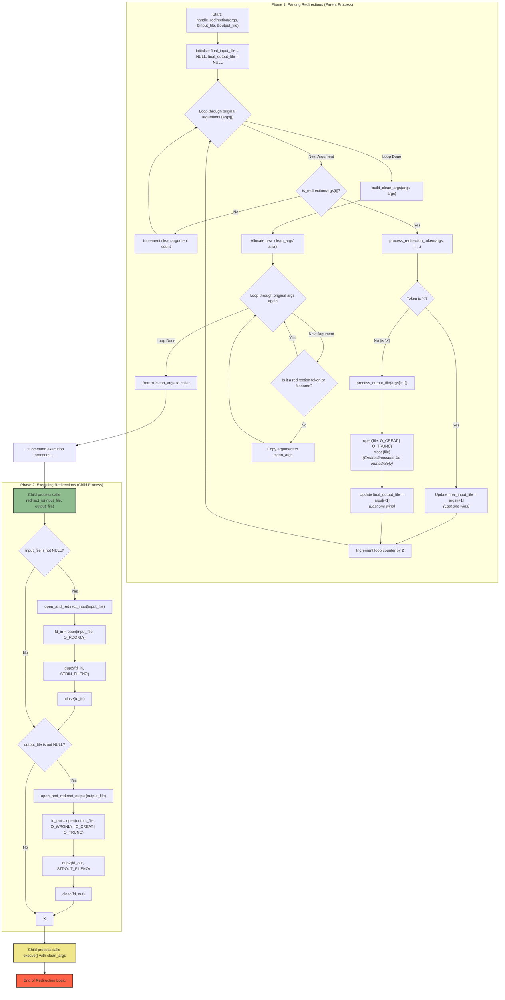

```mermaid
graph TD
    A["Start: handle_redirection(args, &input_file, &output_file)"];

    subgraph "Phase 1: Parsing Redirections (Parent Process)"
        A --> B["Initialize final_input_file = NULL, final_output_file = NULL"];
        B --> C{"Loop through original arguments (args[])"};
        C -- Next Argument --> D{"is_redirection(args[i])?"};
        
        D -- No --> E[Increment clean argument count];
        E --> C;

        D -- Yes --> F["process_redirection_token(args, i, ...)"];
        F --> G{"Token is '<'?"};
        G -- Yes --> H["Update final_input_file = args[i+1]<br><em>(Last one wins)</em>"];
        H --> I[Increment loop counter by 2];
        I --> C;

        G -- No (is '>') --> J["process_output_file(args[i+1])"];
        J --> J1["open(file, O_CREAT | O_TRUNC)<br>close(file)<br><em>(Creates/truncates file immediately)</em>"];
        J1 --> K["Update final_output_file = args[i+1]<br><em>(Last one wins)</em>"];
        K --> I;
        
        C -- Loop Done --> L["build_clean_args(args, argc)"];
        L --> M[Allocate new 'clean_args' array];
        M --> N{Loop through original args again};
        N -- Next Argument --> O{Is it a redirection token or filename?};
        O -- No --> P[Copy argument to clean_args];
        P --> N;
        O -- Yes --> N;
        N -- Loop Done --> Q[Return 'clean_args' to caller];
    end

    Q --> R["... Command execution proceeds ..."];
    R --> S["Child process calls redirect_io(input_file, output_file)"];

    subgraph "Phase 2: Executing Redirections (Child Process)"
        S --> T{"input_file is not NULL?"};
        T -- Yes --> U["open_and_redirect_input(input_file)"];
        U --> U1["fd_in = open(input_file, O_RDONLY)"];
        U1 --> U2["dup2(fd_in, STDIN_FILENO)"];
        U2 --> U3["close(fd_in)"];
        U3 --> V;
        T -- No --> V;

        V{output_file is not NULL?};
        V -- Yes --> W["open_and_redirect_output(output_file)"];
        W --> W1["fd_out = open(output_file, O_WRONLY | O_CREAT | O_TRUNC)"];
        W1 --> W2["dup2(fd_out, STDOUT_FILENO)"];
        W2 --> W3["close(fd_out)"];
        W3 --> X;
        V -- No --> X;
    end

    X --> Y["Child process calls execve() with clean_args"];
    Y --> Z[End of Redirection Logic];


    style S fill:#8fbc8f,stroke:#333,stroke-width:2px
    style Z fill:#ff6347,stroke:#333,stroke-width:2px
    style Y fill:#f0e68c,stroke:#333,stroke-width:2px
```