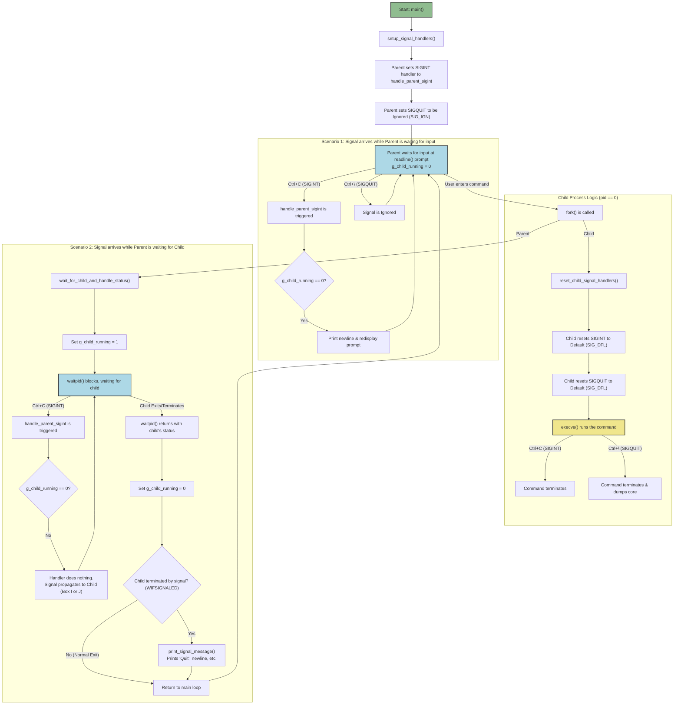

```mermaid
graph TD
    A["Start: main()"] --> B["setup_signal_handlers()"];
    B --> B1["Parent sets SIGINT handler to handle_parent_sigint"];
    B1 --> B2["Parent sets SIGQUIT to be Ignored (SIG_IGN)"];
    B2 --> C["Parent waits for input at readline() prompt<br>g_child_running = 0"];

    subgraph "Scenario 1: Signal arrives while Parent is waiting for input"
        C -- Ctrl+C (SIGINT) --> D[handle_parent_sigint is triggered];
        D --> D1{g_child_running == 0?};
        D1 -- Yes --> D2[Print newline & redisplay prompt];
        D2 --> C;
        C -- Ctrl+\ (SIGQUIT) --> E[Signal is Ignored];
        E --> C;
    end

    C -- User enters command --> F["fork() is called"];

    subgraph "Child Process Logic (pid == 0)"
        F -- Child --> G["reset_child_signal_handlers()"];
        G --> G1["Child resets SIGINT to Default (SIG_DFL)"];
        G1 --> G2["Child resets SIGQUIT to Default (SIG_DFL)"];
        G2 --> H["execve() runs the command"];
        H -- Ctrl+C (SIGINT) --> I[Command terminates];
        H -- Ctrl+\ (SIGQUIT) --> J[Command terminates & dumps core];
    end

    subgraph "Scenario 2: Signal arrives while Parent is waiting for Child"
        F -- Parent --> K["wait_for_child_and_handle_status()"];
        K --> K1["Set g_child_running = 1"];
        K1 --> L["waitpid() blocks, waiting for child"];
        L -- Ctrl+C (SIGINT) --> M[handle_parent_sigint is triggered];
        M --> M1{"g_child_running == 0?"};
        M1 -- No --> M2["Handler does nothing.<br>Signal propagates to Child (Box I or J)"];
        M2 --> L;
        L -- Child Exits/Terminates --> N["waitpid() returns with child's status"];
        N --> N1["Set g_child_running = 0"];
        N1 --> O{"Child terminated by signal? (WIFSIGNALED)"};
        O -- Yes --> P["print_signal_message()<br>Prints 'Quit', newline, etc."];
        O -- No (Normal Exit) --> Q;
        P --> Q[Return to main loop];
        Q --> C;
    end

    style A fill:#8fbc8f,stroke:#333,stroke-width:2px
    style C fill:#add8e6,stroke:#333,stroke-width:2px
    style L fill:#add8e6,stroke:#333,stroke-width:2px
    style H fill:#f0e68c,stroke:#333,stroke-width:2px
```