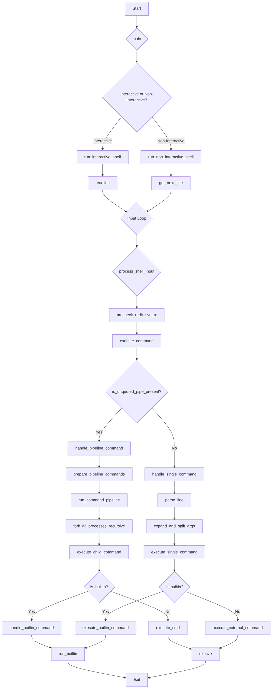

```mermaid
graph TD
    A[Start] --> B{main};
    B --> C{Interactive or Non-Interactive?};
    C -->|Interactive| D[run_interactive_shell];
    C -->|Non-Interactive| E[run_non_interactive_shell];
    D --> F[readline];
    E --> G[get_next_line];
    F --> H{Input Loop};
    G --> H;
    H --> I{process_shell_input};
    I --> J[precheck_redir_syntax];
    J --> K[execute_command];
    K --> L{is_unquoted_pipe_present?};
    L -->|Yes| M[handle_pipeline_command];
    L -->|No| N[handle_single_command];
    M --> O[prepare_pipeline_commands];
    O --> P[run_command_pipeline];
    P --> Q[fork_all_processes_recursive];
    Q --> R[execute_child_command];
    R --> S{is_builtin?};
    S -->|Yes| T[handle_builtin_command];
    S -->|No| U[execute_cmd];
    N --> V[parse_line];
    V --> W[expand_and_split_args];
    W --> X[execute_single_command];
    X --> Y{is_builtin?};
    Y -->|Yes| Z[execute_builtin_command];
    Y -->|No| AA[execute_external_command];
    T --> BB[run_builtin];
    Z --> BB;
    U --> CC[execve];
    AA --> CC;
    BB --> DD[Exit];
    CC --> DD;
```
