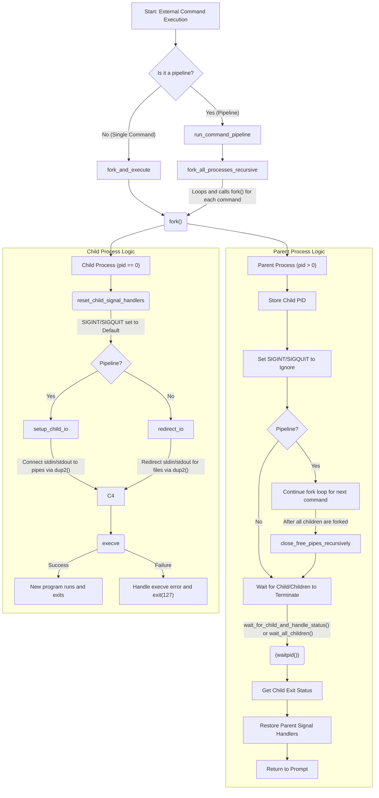

```mermaid
graph TD
    A[Start: External Command Execution];
    A --> B{Is it a pipeline?};

    B -- No (Single Command) --> C[fork_and_execute];
    B -- Yes (Pipeline) --> D[run_command_pipeline];

    C --> E("fork()");
    D --> F[fork_all_processes_recursive];
    F -- "Loops and calls fork() for each command" --> E;
    
    E --> G["Parent Process (pid > 0)"];
    E --> H["Child Process (pid == 0)"];

    subgraph Parent Process Logic
        G --> P1[Store Child PID];
        P1 --> P2["Set SIGINT/SIGQUIT to Ignore"];
        P2 --> P3{Pipeline?};
        P3 -- Yes --> P4["Continue fork loop for next command"];
        P4 -- "After all children are forked" --> P5[close_free_pipes_recursively];
        P3 -- No --> P6;
        P5 --> P6[Wait for Child/Children to Terminate];
        P6 -- "wait_for_child_and_handle_status() <br> or wait_all_children()" --> P7("(waitpid())");
        P7 --> P8[Get Child Exit Status];
        P8 --> P9[Restore Parent Signal Handlers];
        P9 --> P10[Return to Prompt];
    end

    subgraph Child Process Logic
        H --> C1(reset_child_signal_handlers);
        C1 -- "SIGINT/SIGQUIT set to Default" --> C2{Pipeline?};
        
        C2 -- Yes --> C3[setup_child_io];
        C3 -- "Connect stdin/stdout to pipes via dup2()" --> C4;

        C2 -- No --> C5[redirect_io];
        C5 -- "Redirect stdin/stdout for files via dup2()" --> C4;
        
        C4 --> C6(execve);
        C6 -- Success --> C7[New program runs and exits];
        C6 -- Failure --> C8["Handle execve error and exit(127)"];
    end
```