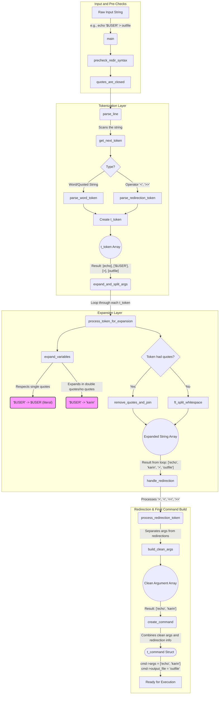

```mermaid
graph TD
    subgraph Input and Pre-Checks
        A[Raw Input String] -->|"e.g., "echo '$USER' > outfile""| B(main);
        B --> C[precheck_redir_syntax];
        C --> D[quotes_are_closed];
    end

    subgraph Tokenization Layer
        D --> E(parse_line);
        E -- "Scans the string" --> F(get_next_token);
        F --> G{Type?};
        G -->|Word/Quoted String| H[parse_word_token];
        G -->|Operator '<', '>>'| I[parse_redirection_token];
        H --> J[Create t_token];
        I --> J;
        J --> K((t_token Array));
        K -- "Result: [echo], ['$USER'], [>], [outfile]" --> L(expand_and_split_args);
    end

    subgraph Expansion Layer
        L -- "Loop through each t_token" --> M(process_token_for_expansion);
        M --> N(expand_variables);
        N -- "Respects single quotes" --> N_details("'$USER' -> $USER (literal)");
        N -- "Expands in double quotes/no quotes" --> N_details2("'$USER' -> 'karin'");
        M --> O{Token had quotes?};
        O -->|Yes| P[remove_quotes_and_join];
        O -->|No| Q[ft_split_whitespace];
        P --> R((Expanded String Array));
        Q --> R;
        R -- "Result from loop: ['echo', 'karin', '>', 'outfile']" --> S(handle_redirection);
    end
    
    subgraph Redirection & Final Command Build
        S -- "Processes '>', '<', '<<', '>>'" --> T(process_redirection_token);
        T -- "Separates args from redirections" --> U[build_clean_args];
        U --> V((Clean Argument Array));
        V -- "Result: ['echo', 'karin']" --> W(create_command);
        W -- "Combines clean args and redirection info" --> X([t_command Struct]);
        X -- "cmd->args = ['echo', 'karin']\ncmd->output_file = 'outfile'" --> Y[Ready for Execution];
    end

    style N_details fill:#f9f,stroke:#333,stroke-width:2px
    style N_details2 fill:#f9f,stroke:#333,stroke-width:2px
```