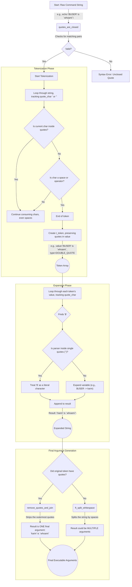

```mermaid
graph TD
    A[Start: Raw Command String];
    A -- "e.g., echo \"'$USER' is `whoami`\"" --> B(quotes_are_closed);
    B -- Checks for matching pairs --> C{Valid?};
    C -- No --> D[Syntax Error: Unclosed Quote];
    C -- Yes --> E[Start Tokenization];

    subgraph Tokenization Phase
        E --> F["Loop through string, tracking quote_char ' or ''"];
        F --> G{Is current char inside quotes?};
        G -- Yes --> H[Continue consuming chars, even spaces];
        G -- No --> I{Is char a space or operator?};
        I -- Yes --> J[End of token];
        I -- No --> H;
        J --> K[Create t_token, preserving quotes in value];
        K -- "e.g., value='$USER' is `whoami`, type=DOUBLE_QUOTE" --> L((Token Array));
    end

    subgraph Expansion Phase
        L --> M["Loop through each token's value, tracking quote_char"];
        M --> N{Finds '$'};
        N --> O{"Is parser inside single quotes ('')?"};
        O -- Yes --> P["Treat '$' as a literal character"];
        O -- No --> Q["Expand variable (e.g., $USER -> karin)"];
        P --> R[Append to result];
        Q --> R;
        R -- "Result: \"'karin' is `whoami`\"" --> S((Expanded String));
    end

    subgraph Final Argument Generation
        S --> T{Did original token have quotes?};
        T -- Yes --> U(remove_quotes_and_join);
        U -- "Strips the outermost quotes" --> V["Result is ONE final argument:<br/>'karin' is `whoami`"];
        T -- No --> W(ft_split_whitespace);
        W -- "Splits the string by spaces" --> X["Result could be MULTIPLE arguments"];
        V --> Y((Final Executable Arguments));
        X --> Y;
    end
```