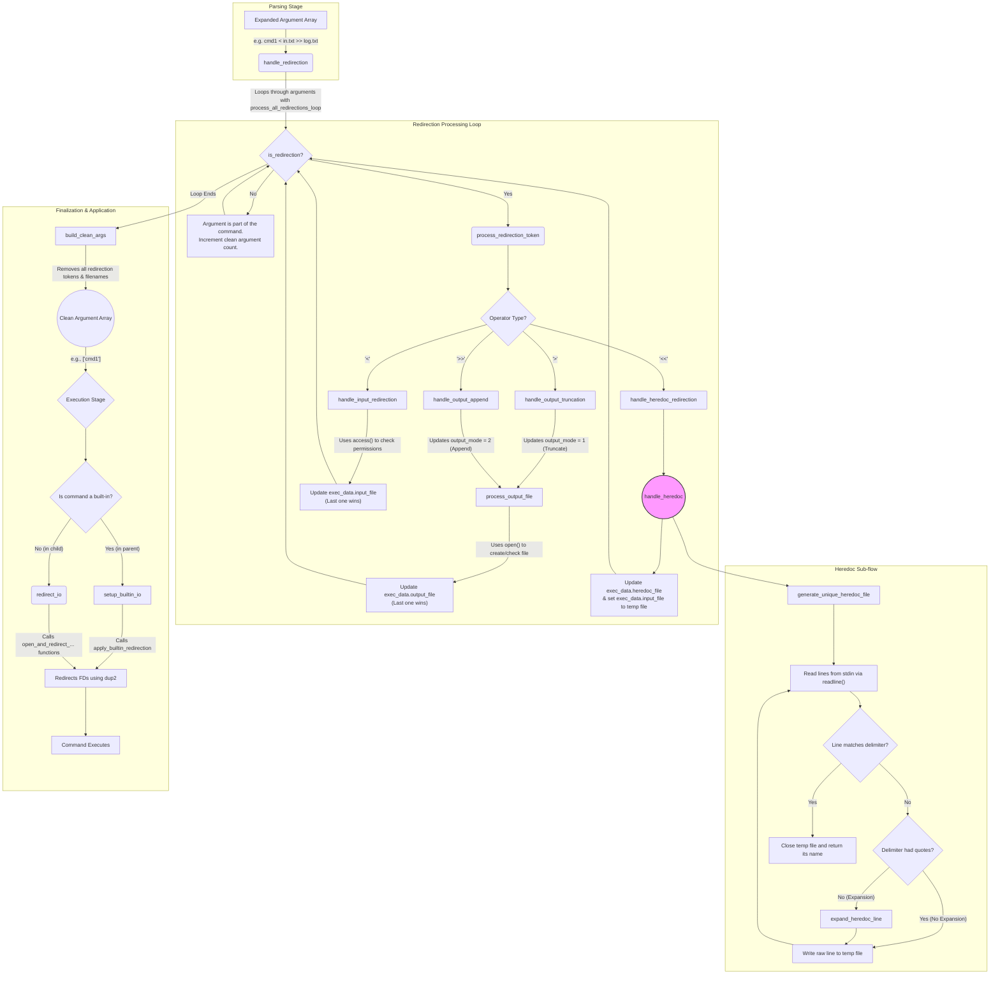

```mermaid
graph TD
    subgraph Parsing Stage
        A[Expanded Argument Array] -->|"e.g. cmd1 < in.txt >> log.txt"| B(handle_redirection);
    end

    subgraph Redirection Processing Loop
        B -- "Loops through arguments with process_all_redirections_loop" --> C{is_redirection?};
        C -- No --> D["Argument is part of the command.<br/>Increment clean argument count."];
        D --> C;
        C -- Yes --> E(process_redirection_token);
        E --> F{Operator Type?};

        F -->|'>'| G[handle_output_truncation];
        F -->|'>>'| H[handle_output_append];
        F -->|'<'| I[handle_input_redirection];
        F -->|'<<'| J[handle_heredoc_redirection];

        G -- "Updates output_mode = 1 (Truncate)" --> K[process_output_file];
        H -- "Updates output_mode = 2 (Append)" --> K;
        K -- "Uses open() to create/check file" --> L["Update exec_data.output_file<br/>(Last one wins)"];

        I -- "Uses access() to check permissions" --> M["Update exec_data.input_file<br/>(Last one wins)"];

        J --> N((handle_heredoc));

        L --> C;
        M --> C;
        N --> O["Update exec_data.heredoc_file<br/>& set exec_data.input_file to temp file"];
        O --> C;
    end
    
    subgraph Heredoc Sub-flow
        style N fill:#f9f,stroke:#333,stroke-width:2px
        N --> N1[generate_unique_heredoc_file];
        N1 --> N2["Read lines from stdin via readline()"];
        N2 --> N3{Line matches delimiter?};
        N3 -- No --> N4{Delimiter had quotes?};
        N4 -- Yes (No Expansion) --> N6["Write raw line to temp file"];
        N4 -- No (Expansion) --> N5[expand_heredoc_line];
        N5 --> N6;
        N6 --> N2;
        N3 -- Yes --> N7["Close temp file and return its name"];
    end

    subgraph Finalization & Application
        C -- "Loop Ends" --> P[build_clean_args];
        P -- "Removes all redirection tokens & filenames" --> Q((Clean Argument Array));
        Q -- "e.g., ['cmd1']" --> R{Execution Stage};
        
        R --> S{Is command a built-in?};
        S -- "Yes (in parent)" --> T[setup_builtin_io];
        S -- "No (in child)" --> U(redirect_io);

        T -- "Calls apply_builtin_redirection" --> V["Redirects FDs using dup2"];
        U -- "Calls open_and_redirect_... functions" --> V;
        V --> W[Command Executes];
    end
```
