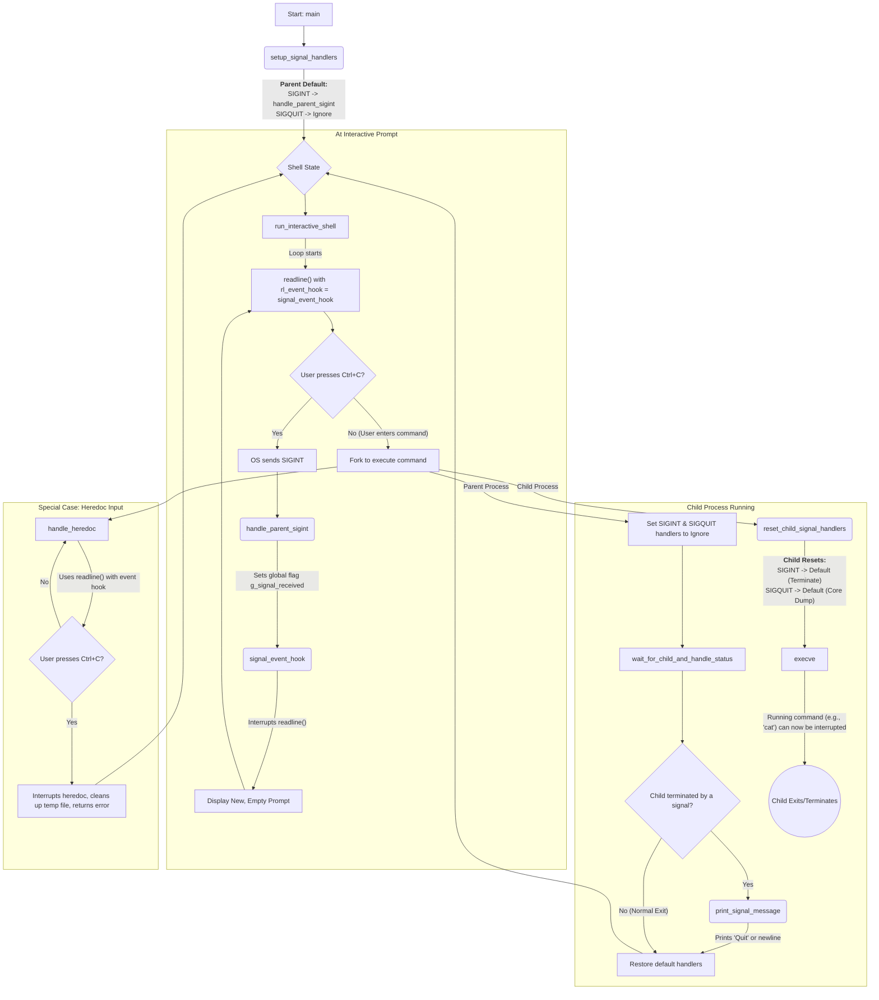

```mermaid
graph TD
    A[Start: main] --> B(setup_signal_handlers);
    B -- "<b>Parent Default:</b><br/>SIGINT -> handle_parent_sigint<br/>SIGQUIT -> Ignore" --> C{Shell State};

    subgraph At Interactive Prompt
        C --> D[run_interactive_shell];
        D -- "Loop starts" --> E["readline() with <br>rl_event_hook = signal_event_hook"];
        E --> F{User presses Ctrl+C?};
        F -- Yes --> G[OS sends SIGINT];
        G --> H(handle_parent_sigint);
        H -- "Sets global flag g_signal_received" --> I(signal_event_hook);
        I -- "Interrupts readline()" --> J[Display New, Empty Prompt];
        J --> E;
        F -- No (User enters command) --> K[Fork to execute command];
    end

    subgraph Child Process Running
        K -- Parent Process --> L["Set SIGINT & SIGQUIT handlers to Ignore"];
        L --> M[wait_for_child_and_handle_status];
        M --> N{Child terminated by a signal?};
        N -- Yes --> O(print_signal_message);
        O -- "Prints 'Quit' or newline" --> P[Restore default handlers];
        N -- No (Normal Exit) --> P;
        P --> C;

        K -- Child Process --> Q(reset_child_signal_handlers);
        Q -- "<b>Child Resets:</b><br/>SIGINT -> Default (Terminate)<br/>SIGQUIT -> Default (Core Dump)" --> R[execve];
        R -- "Running command (e.g., 'cat') can now be interrupted" --> S((Child Exits/Terminates));
    end

    subgraph Special Case: Heredoc Input
        K --> T[handle_heredoc];
        T -- "Uses readline() with event hook" --> U{User presses Ctrl+C?};
        U -- Yes --> V[Interrupts heredoc, cleans up temp file, returns error];
        V --> C;
        U -- No --> T;
    end
```
