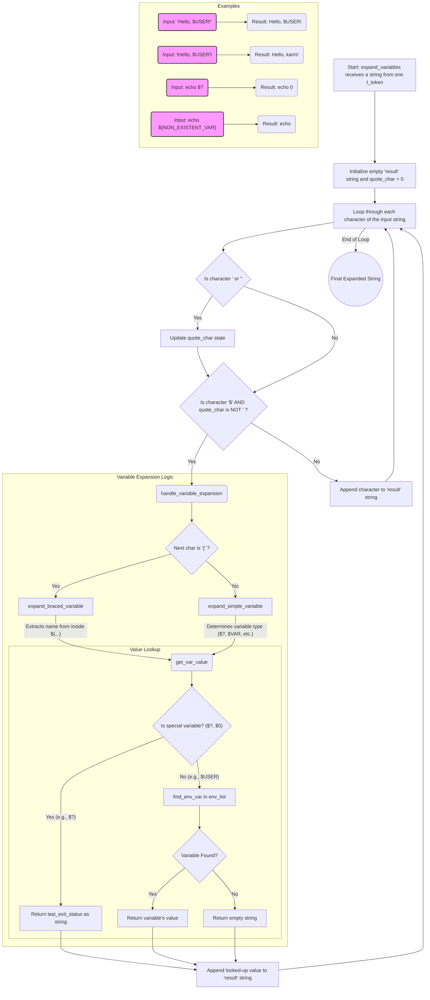

```mermaid
graph TD
    A[Start: expand_variables receives a string from one t_token];
    A --> B["Initialize empty 'result' string and quote_char = 0"];
    B --> C["Loop through each character of the input string"];
    C --> D{Is character ' or ''};
    D -- Yes --> E[Update quote_char state];
    E --> F;
    D -- No --> F;
    
    F{Is character '$' AND quote_char is NOT ' ?};
    F -- No --> G[Append character to 'result' string];
    G --> C;
    
    F -- Yes --> H(handle_variable_expansion);
    
    subgraph Variable Expansion Logic
        H --> I{"Next char is '{' ?"};
        I -- Yes --> J[expand_braced_variable];
        J -- "Extracts name from inside ${...}" --> K;
        
        I -- No --> L[expand_simple_variable];
        L -- "Determines variable type ($?, $VAR, etc.)" --> K(get_var_value);

        subgraph Value Lookup
            K --> M{"Is special variable? ($?, $0)"};
            M -- "Yes (e.g., $?)" --> N[Return last_exit_status as string];
            M -- "No (e.g., $USER)" --> O[find_env_var in env_list];
            O --> P{Variable Found?};
            P -- Yes --> Q[Return variable's value];
            P -- No --> R[Return empty string ""];
        end
    end
    
    N --> S;
    Q --> S;
    R --> S;
    
    S[Append looked-up value to 'result' string];
    S --> C;
    
    C -- End of Loop --> T((Final Expanded String));

    subgraph Examples
        ex1("Input: 'Hello, $USER!'") --> ex2("Result: Hello, $USER!");
        ex3("Input: \"Hello, $USER!\"") --> ex4("Result: Hello, karin!");
        ex5("Input: echo $?") --> ex6("Result: echo 0");
        ex7("Input: echo ${NON_EXISTENT_VAR}") --> ex8("Result: echo ");
    end
    
    style ex1 fill:#f9f,stroke:#333,stroke-width:2px
    style ex3 fill:#f9f,stroke:#333,stroke-width:2px
    style ex5 fill:#f9f,stroke:#333,stroke-width:2px
    style ex7 fill:#f9f,stroke:#333,stroke-width:2px
```
